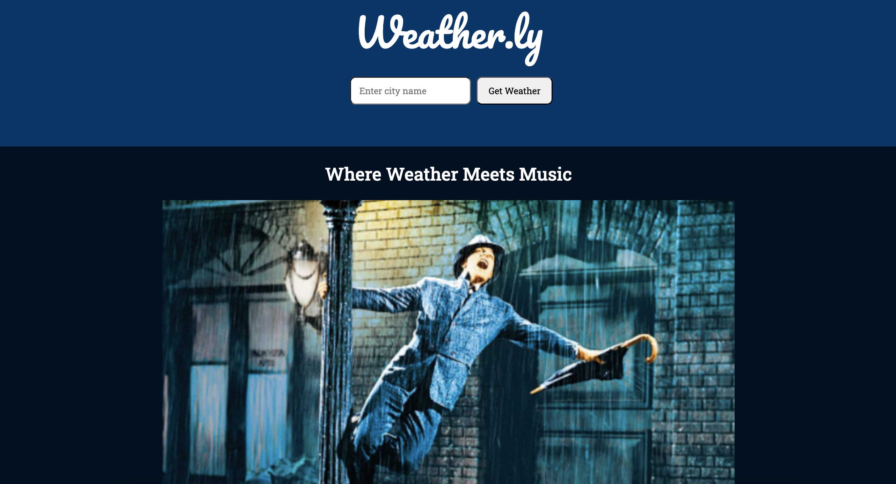

# Weather.ly App

## Description

This project was created as a group for UT's Full Stack Bootcamp. Our goal for the "Weather.ly" app webpage was to connect the user with a Spotify playlist based on the current weather in their region, or the location input in the text box. Weather.ly utilizes two APIs: OpenWeather, and Spotify's API. 

OpenWeather provides many options for weather conditions, which we grouped into the following categories: Rainy, Snowy, Cloudy, Sunny, and a few miscellaneous options. We created a modal feature where the user can change their playlist if the one they generated is not what they are looking for. The webpage's color-theme changes based on the playlist generated for each weather condition. Additionally, users can choose to save their favorite location to their local storage.

## Credit

Code created by Nicholas, Bridgett, Shawn, Taylor, and Kathryn.

## Links

Link to Weather.ly: https://nramos9071.github.io/group-project-1/
Link to repository: https://github.com/nramos9071/group-project-1

## Webpage Screenshot
